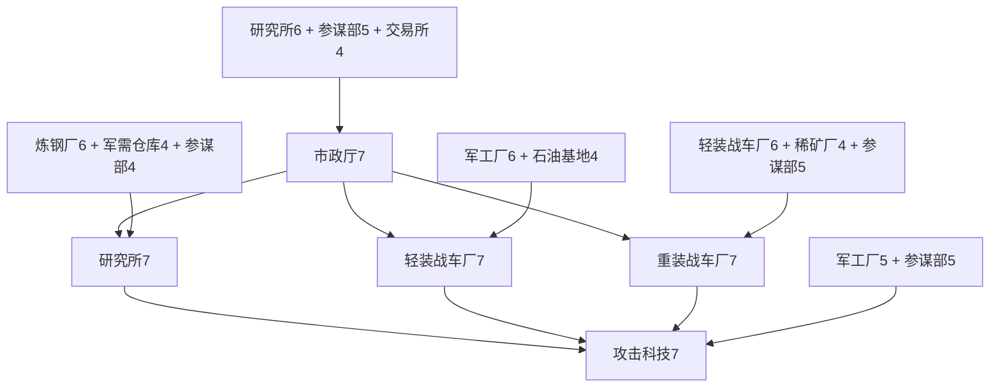

# 科技与建筑级联前置设计

日期：2026-09-27。状态：已接入游戏，逐级规则由服务端运行配置加载。

## 1. 目标与适用范围

让玩家形成「升级基础设施 → 建立兵种工业 → 提升科研能力 → 研究科技 → 解锁下一轮建设」的成长节奏。科技提供升级动机，建筑提供真实的研发条件；建筑之间用有先后次序的配套关系约束，避免只升级研究所或指挥部。

本方案覆盖当前定义中的 **21 种建筑、16 项科技**。建筑仍为 1—10 级；科技保留当前 10 级、5 级、3 级上限，保留现有科技效果、费用与工期公式。以下等级是当前运行的初始配置。

名称沿用项目当前名称：

- 用户所说的「战时指挥部」对应 **市政厅 `command`**。
- 「重工厂」对应 **重装战车厂 `heavyfactory`**。
- 「停机坪」对应 **战备机场 `apron`**。
- **军工厂 `factory`** 与轻装、重装战车厂分别是三种建筑。

设计采用「所有建筑最终都要建造升级，但不在开局一次性要求齐全」的口径。20 种陆上建筑纳入指挥部和科研主线；军港只建在沿海城市，在研究所冲击 10 级时要求玩家任一沿海城已有 8 级军港，形成全账号的最后一项联合军工门槛。内陆城市升到 10 级指挥部不依赖军港。

## 2. 统一判定规则

1. 所有等级均按**要升到的目标等级**计算，例如重装战车厂 6→7，查 7 级规则。
2. 同一行列出的条件全部为 **AND**，全部满足才能开始；不能用资源、钻石或加速道具跳过前置。
3. 普通建筑目标等级为 L 时，要求本城市政厅达到 `max(L, 首建指挥部等级)`。指挥部自身查专用表。
4. 同类多栋建筑取**单栋最高已完成等级**，不取等级总和。两座 4 级兵工厂不能替代一座 8 级兵工厂；多建其他建筑仍有产量、容量和征召用途。
5. 前置默认必须在**当前城市**。科技成果与科研队列保持全账号共享；在哪个城市发起研究，该城就必须具备完整研究配套。仅研究所 10 级的军港条件允许来自账号任一所属沿海城。
6. 未完工目标等级不计入。建筑 5→6 施工期间按已完成 5 级计；处于拆除/降级中的建筑不能作为新的前置来源。
7. 建筑不要求先研究某项科技，防止「科技要建筑、建筑又要同项科技」死循环。已研究科技可继续提供现有建设优惠。
8. 资源、地形、空位、施工队、已有任务等原限制继续独立校验；满足本方案并不免除其他条件。

建筑配套表使用两个简写：

| 目标等级 L | 1 | 2 | 3 | 4 | 5 | 6 | 7 | 8 | 9 | 10 |
| --- | ---: | ---: | ---: | ---: | ---: | ---: | ---: | ---: | ---: | ---: |
| 配套等级 Q = max(1, L−1) | 1 | 1 | 2 | 3 | 4 | 5 | 6 | 7 | 8 | 9 |
| 基础等级 H = ceil(L÷2) | 1 | 1 | 2 | 2 | 3 | 3 | 4 | 4 | 5 | 5 |

Q 表示需要持续升级的主要配套，H 表示进度可以稍慢的基础保障。只使用整数等级，所有前置随目标等级单调增加。

## 3. 指挥部升级：分批引入建筑

指挥部只依赖当前指挥部等级以内的建筑，不要求任何配套先升到目标指挥部等级。表中条件是该次升级的直接条件，无须每次重验所有历史里程碑。

| 指挥部目标等级 | 本城直接前置 | 本阶段建设主题 |
| ---: | --- | --- |
| 1 | 无建筑前置 | 建立基地 |
| 2 | 农田 1、炼钢厂 1、民居 1 | 粮食、工业、兵源 |
| 3 | 军工厂 2、军需仓库 2、军工科技研发中心 1 | 基础征召与科研 |
| 4 | 轻装战车厂 3、军校 2、战地兵站 2 | 轻装机械化与军官 |
| 5 | 重装战车厂 4、作战参谋部 3、稀矿厂 3 | 重装工业与指挥 |
| 6 | 空军基地 4、战备机场 4、防空雷达站 4 | 空中作战体系 |
| 7 | 军工科技研发中心 6、作战参谋部 5、交易所 4 | 中期科研与补给整合 |
| 8 | 军工厂 7、要塞防线 6、机要通讯处 5 | 动员、防御、通信 |
| 9 | 重装战车厂 8、空军基地 7、战地兵站 7 | 高阶陆空协同 |
| 10 | 军工科技研发中心 9、作战参谋部 8、军需仓库 9 | 战略科研准备 |

开局不强迫建造全部建筑；到指挥部 8 级之前，所有陆上建筑已经分批进入主线。升级到更高指挥部等级后，玩家再将专业建筑追平并研究相应科技，不能单独冲指挥部一路跳过配套。

## 4. 全部建筑的首建与升级关系

除指挥部外，下面每行均额外要求本城指挥部 `max(L, 首建等级)`；「逐级配套」对首建也适用，例如 Q(1)=1。高阶附加条件从指定等级起持续生效。

| 建筑 / 标识 | 首建指挥部 | 逐级配套 | 高阶附加条件 | 升级的实际用途 |
| --- | ---: | --- | --- | --- |
| 市政厅 `command` | — | 见第 3 节 | 无 | 建筑上限、城市建筑容量与阶段推进 |
| 农田 `farm` | 1 | 无额外配套 | 无 | 粮食产出、军需补给、医疗配套 |
| 炼钢厂 `refinery` | 1 | 无额外配套 | 无 | 钢铁产出、军工建设与建筑加速科研 |
| 石油基地 `oilfield` | 1 | 炼钢厂 H | 无 | 燃料产出、装甲/航空/海军动力科研 |
| 稀矿厂 `raremine` | 2 | 炼钢厂 Q、石油基地 H | 无 | 稀矿产出、重装工艺与精密科研 |
| 军需仓库 `depot` | 1 | 炼钢厂 H | 无 | 容量与保护、仓储技术、兵站与高阶科研 |
| 民居 `house` | 1 | 农田 H | 无 | 人口与兵员容量、军队生命、医疗科研 |
| 军工厂 `factory` | 1 | 民居 H、炼钢厂 Q | 无 | 基础征召、轻装工业、训练科研 |
| 军校 `academy` | 2 | 民居 Q | 无 | 军官招募、参谋部与训练科研 |
| 战地兵站 `transit` | 2 | 军需仓库 Q、石油基地 H | 无 | 资源增产、补给、起飞场及军港后勤 |
| 军工科技研发中心 `lab` | 1 | 炼钢厂 Q、军需仓库 H | L≥4：作战参谋部 max(1,L−3)；L=10：账号任一所属沿海城军港 8 | 每级开放科研层级并沿用研究速度收益 |
| 轻装战车厂 `lightfactory` | 2 | 军工厂 Q、石油基地 H | 无 | 轻坦、攻击科研、重装工厂前置 |
| 重装战车厂 `heavyfactory` | 3 | 轻装战车厂 Q、稀矿厂 H | L≥7：作战参谋部 L−2 | 重坦、攻击科研与大型舰船工业 |
| 作战参谋部 `staff` | 3 | 军校 Q、民居 Q | 无 | 军官/野地容量、指挥部突破与高级科研 |
| 要塞防线 `wall` | 1 | 炼钢厂 Q、民居 H | 无 | 守城、防御科研，保留现有满级带兵收益 |
| 防空雷达站 `radar` | 2 | 军工科技研发中心 H | 无 | 预警、侦察、射程和航空科研 |
| 战备机场 `apron` | 3 | 石油基地 Q、战地兵站 H | 无 | 起降与出击保障、航空科研、空军基地前置 |
| 空军基地 `airport` | 4 | 战备机场 Q、轻装战车厂 H | L≥7：防空雷达站 L−2 | 航空研究主设施；生产归属问题见第 10 节 |
| 军港船坞 `port` | 5 | 重装战车厂 Q、战地兵站 H | 必须沿海；此处前置均在军港本城 | 海军征召、舰船动力、10 级研究所验收 |
| 机要通讯处 `liaison` | 3 | 防空雷达站 Q、作战参谋部 H | 无 | 情报联络、侦察与雷达科研；无需加入军团 |
| 交易所 `exchange` | 3 | 军需仓库 Q、战地兵站 H | 无 | 资源转换、仓储与建筑加速科研 |

**明确的重装链示例：**

- 新建重装战车厂 1：指挥部 3、轻装战车厂 1、稀矿厂 1。
- 重装战车厂 6→7：指挥部 7、轻装战车厂 6、稀矿厂 4、作战参谋部 5。
- 指挥部 6→7：先完成研究所 6、参谋部 5、交易所 4；这些都能在指挥部 6 时完成。
- 参谋部 5：需要指挥部 5、军校 4、兵舍 4；不会反过来要求重装战车厂 7。

**军港的最终必建规则：**玩家可以先把内陆指挥部升到 10；随后在沿海城完成 8 级军港，再把科研城研究所升到 10。这样满级科研确实需要海军工业，又不产生「无军港不能升指挥部、无指挥部不能建军港」的封锁。此规则不要求内陆城市迁城，也不要求每个城市建军港。沿海建城名额、可用地点必须在这个阶段之前可获得。

## 5. 科技等级与建筑等级的映射

每项科技的目标等级映射为科研层级 P，再结合该科技的主建筑、配套建筑得到完整门槛。所有科技保留现有效果。

P 为科技对应的科研层级；S = max(1, P−2)，表示允许落后两级的配套。研究所要求为 `max(该科技原始研究所门槛, P)`。专业主建筑达到 P，配套达到 S。防御科技研究所起始门槛为 2，前后端展示已统一。

| 科技上限/类型 | 科技目标等级 | 对应科研层级 P |
| --- | --- | --- |
| 10 级科技 | 1、2、3、4、5、6、7、8、9、10 | 1、2、3、4、5、6、7、8、9、10 |
| 步兵负重、仓储技术（5 级） | 1、2、3、4、5 | 2、4、6、8、10 |
| 侦察技术（5 级） | 1、2、3、4、5 | 1、3、5、7、10 |
| 雷达预警（3 级） | 1、2、3 | 2、6、10 |

因此 5 级或 3 级科技的最后一级同样对应 10 级基础设施，不会出现低上限科技提前毕业。研究所只是必要条件：攻击科技首次研究实际上需要指挥部 3，喷气推进首次研究需要指挥部 4；UI 应展示建筑递归链带来的实际要求。

## 6. 全部 16 项科技的建筑前置

每行还需满足研究所 `max(起始门槛, P)`。所有要求都是本城条件；主建筑、配套与高阶附加要求取并集，同一建筑取较高等级。

| 科技 / 标识 | 上限 | 研究所起始门槛 | 主建筑 P | 配套 S | 分阶段附加条件 |
| --- | ---: | ---: | --- | --- | --- |
| 攻击科技 `attack_tech` | 10 | 1 | 轻装战车厂、重装战车厂 | 军工厂 | P≥7：作战参谋部 S |
| 防御科技 `defense_tech` | 10 | 2 | 要塞防线 | 民居、军需仓库 | P≥7：防空雷达站 S |
| 武器射程 `weapon_range` | 10 | 2 | 防空雷达站、稀矿厂 | 军工厂 | P≥7：作战参谋部 S |
| 军队生命 `cmd_hp` | 10 | 3 | 民居 | 军校、农田 | P≥7：作战参谋部 S |
| 步兵负重 `inf_load` | 5 | 2 | 军工厂、战地兵站 | 军需仓库 | 无 |
| 燃烧引擎 `arm_engine` | 10 | 3 | 轻装战车厂、石油基地 | 重装战车厂 | 无 |
| 喷气推进 `air_engine` | 10 | 4 | 空军基地、战备机场 | 石油基地 | P≥6：防空雷达站 S |
| 舰船动力 `nav_engine` | 10 | 5 | 军港船坞 | 石油基地、重装战车厂、战地兵站 | 无 |
| 资源采集 `log_production` | 10 | 1 | 农田、炼钢厂 | 无 | P≥3：石油基地 S；P≥3：稀矿厂 S |
| 仓储技术 `log_warehouse` | 5 | 2 | 军需仓库、交易所 | 战地兵站 | 无 |
| 军需补给 `log_food` | 10 | 3 | 农田、战地兵站 | 民居 | 无 |
| 训练加速 `log_train` | 10 | 2 | 军工厂、军校 | 民居 | 无 |
| 建筑加速 `log_build` | 10 | 2 | 炼钢厂、交易所 | 军需仓库 | 无 |
| 医疗技术 `log_medical` | 10 | 3 | 民居、军校 | 农田、战地兵站 | 无 |
| 侦察技术 `recon_level` | 5 | 1 | 防空雷达站 | 无 | P≥3：机要通讯处 P；P≥3：作战参谋部 S |
| 雷达预警 `recon_radar` | 3 | 2 | 防空雷达站、作战参谋部 | 机要通讯处 | 无 |

所有 21 种建筑都在某项科技的满级依赖链中达到 10 级：指挥部通过建筑上限参与，研究所通过统一科研门槛参与，其余 19 种通过专业科技参与。玩家研究单一方向时可以先专精，目标若是全科技毕业，则每一种建筑至少要有一栋升到 10；军港和舰船动力在沿海城完成。无需把同类所有建筑都升满。

## 7. 玩家能直接看到的等级示例

### 攻击科技

| 科技目标等级 | 研究所 | 轻装战车厂 | 重装战车厂 | 军工厂 | 作战参谋部（直接要求） |
| ---: | ---: | ---: | ---: | ---: | --- |
| 1 | 1 | 1 | 1 | 1 | — |
| 3 | 3 | 3 | 3 | 1 | — |
| 5 | 5 | 5 | 5 | 3 | — |
| 7 | 7 | 7 | 7 | 5 | 5 |
| 10 | 10 | 10 | 10 | 8 | 8 |

表中“—”表示科技没有直接追加该条件；建筑自身的逐级配套仍有效。例如重装战车厂 6 本身就会沿建设链要求其他工业设施。

### 喷气推进（飞行类科技）

| 科技目标等级 | 研究所 | 空军基地 | 战备机场 | 石油基地 | 防空雷达站（直接要求） |
| ---: | ---: | ---: | ---: | ---: | --- |
| 1 | 4 | 1 | 1 | 1 | — |
| 3 | 4 | 3 | 3 | 1 | — |
| 5 | 5 | 5 | 5 | 3 | — |
| 7 | 7 | 7 | 7 | 5 | 5 |
| 10 | 10 | 10 | 10 | 8 | 8 |

### 完整的中期升级顺序

以下为攻击科技 6→7 的目标顺序示意；玩家已满足的步骤自动跳过，兄弟步骤可以用现有 6 支施工队并行完成。



图只展开当前目标的关键前置，完整递归链以逐级配置为准；箭头表示“先满足，再进行”。

## 8. 提示与引导：让玩家知道下一步做什么

### 科技页

科技保持可见，未解锁时显示锁定状态、下一等级收益、所需建筑以及实际差距。允许预览后续所有等级。不要仅在点击研究后弹出一句「条件不足」。

例如研究攻击科技 7，当前研究所 7、轻装战车厂 7、重装战车厂 6、兵工厂 6、参谋部 5：

```text
攻击科技 6 → 7
研究所          7 / 7  已满足
轻装战车厂      7 / 7  已满足
重装战车厂      6 / 7  待升级    [前往升级]
军工厂      6 / 5  已满足
作战参谋部      5 / 5  已满足
研究按钮：需先将重装战车厂升至 7 级
```

点击重装战车厂后展开该厂的前置；按尚未完成的条件，继续指向指挥部、轻装厂、稀矿厂或参谋部。存在多座时定位最高已完成等级的那座，不能直接选中低等级副本或把多座等级相加。

### 建筑页

同时显示「升级还缺什么」和「升完能解锁什么」。例如重装战车厂 7 显示可满足攻击科技 7 的工厂要求，并注明研究所、轻装厂等条件还需另外满足，不能把一个前置达成误报成科技已解锁。

军港缺地形时显示「需沿海城市」；内陆研究所 10 的军港验收显示当前账号最高军港等级和所在城市，并提供切城入口。没有沿海城时指向现有建城/占领玩法，不能指引玩家在内陆反复点击新建军港。

### 建设目标清单

玩家可标记一个科技目标。系统递归展开未满足条件，合并同城同类重复要求并取最高等级，排列成可执行清单。清单默认仅显示下一批可建设的末端条件；完整链按需展开。多个已具备前置的步骤可并行，但不自动扣资源、开工或消耗加速道具。

「施工中」标明剩余时间但不计为达标。「全部满足但资源不足」「施工队已满」「无建筑空位」与「前置未满足」分别显示，防止玩家完成前置后仍不知道为什么不能开工。

## 9. 队列、拆除与存量玩家

- 开始建造、升级或研究时，由服务端在扣费前统一判定；前端展示只是预览。两个请求同时改动前置时必须在同一城的并发控制下处理，防止刚通过校验就被另一请求拆除。
- 新任务开启时，只用已完成且未处于拆除状态的建筑；升级中的 5 级建筑仍能满足 5 级要求，不能满足 6 级要求。
- 新任务记录规则版本和直接前置条件快照。拆除/降级时按施工或科研城市重新求最高单栋等级；若会使进行中的任务缺少必要前置，则拒绝拆除并指出受影响任务。存在另一座合格建筑时允许拆除。
- 研究一旦开始，工期沿用启动时的计算，不因后续研究所继续升级而反复重算。已获得科技永久保留，已完成建筑不自动降级，不追溯收回战力。
- 已完成任务的前置不是永久拆除禁令。玩家可在队列结束后调整城市布局，但下一次升级和研究必须重新达标；重复多栋建筑的资源与产能价值仍由现有系统决定。
- 上线时，既有建筑、科技和已付费队列正常保留/完成；之后的新任务才使用新规则。不把历史缺失的前置当成存档错误。已有满级研究所不强制降回 9，也不追回已学科技。
- 因此「满科技必须全建筑」是**新规则下从零发展时的保证**；存量账号按保留成果原则可能存在历史豁免。迁移界面应明确说明，不能宣称旧玩家已满足新体系。
- 侦察和攻击开局门槛提高，需要同步调整新手任务：先建立基础生产、指挥部 2 与雷达，再学习侦察 1；到指挥部 3 建成轻装/重装厂后学习攻击 1。基础征召和已有侦察行动不新增科技门槛。

## 10. 接入后的接口与兼容处理

本节记录落地时解决的接口差异；规则在服务端判定，前端通过 `/api/game/prerequisites` 获取同一版本配置。

1. `TechService.startResearch` 和 `BuildService.upgrade` 按目标等级读取服务端规则，在扣费前校验；原有资源、施工队、容量和地形限制继续有效。
2. 前置等级单独取本城同类建筑最高已完成等级，不复用产量、容量或兵员统计中的等级求和。
3. 战斗机、轰炸机、运输机的新征召归空军基地；侦察机留在军工厂。旧征召队列通过迁移保留原工厂归属。
4. 空军基地已纳入前后端军事建筑容量分组；防御科技的研究所起始等级按 2 统一。
5. 规则 API 返回逐级配置，游戏状态返回本城建筑等级和账号沿海军港最高等级，前端计算预览差距。服务端仍是最终裁决者，失败响应返回缺失条件。
6. 军港只允许沿海城市建造。沿海建城地点、名额和资源节奏仍需在实际运营环境中验收，不增加付费迁城条件。

## 11. 节奏与配套价值

| 阶段 | 主要体验 | 应避免的问题 |
| --- | --- | --- |
| 指挥部 1—3 | 生产、征召、侦察、初级科研；首次形成轻装→重装链 | 新手同时看到二十项红色缺失条件 |
| 指挥部 4—6 | 军官、重装、起飞场与空军基地逐步成套 | 先要求使用某兵种，之后才给出它的建筑入口 |
| 指挥部 7—8 | 参谋、仓储、通信、调拨和城防全部进入主线 | 每次点击只揭示一个新的缺失条件，形成盲目补建筑 |
| 指挥部 9—10 | 主力专业建筑追平，沿海工业支持满级科研 | 重复建设同一低级建筑就能凑出高阶等级要求 |

强制建设需要伴随看得见的回报：生产建筑继续增加产量，兵舍和仓库继续增加容量，军工厂有对应征召职责；军校、参谋、雷达、通信、调拨、起飞场各承担专业科技的主配套，而非只在首建时使用一次。不要为这套门槛再叠加一轮研究费用或工期倍率。

当前军事建筑容量为 `min(32, 12 + 指挥部等级×2)`。全套设施共 17 种计入军事分组、4 种计入资源分组；足够容纳每种至少一座，剩余位置可用于重复兵舍、仓库、兵工厂与生产设施。目标规划应预留未建的关键设施位置，不能假设玩家已经占满的重复建筑都会自动腾位。

设计未声称具体小时/天数已经平衡。试玩需要记录每次科技升级引出的额外建筑数量、资源缺口、仓储容量是否装得下最高单笔费用以及串行等待时间。若中期等待过重，优先降低配套等级或调整里程碑，不通过削弱科技实际收益解决。

## 12. 配置与结构验证

逐级设计配置位于 [tech-building-prerequisites-design.json](balance/tech-building-prerequisites-design.json)，包含建筑 210 条、科技 138 条目标等级规则。服务端加载 `backend/src/main/resources/game/tech-building-prerequisites.json` 中的同版运行配置；设计稿仍保留 `design-only-not-runtime-config` 标记，以区分两种用途。

本次验证把内陆科研城与沿海工业城展开成带等级的依赖节点，同时计入每项升级的前一等级，不只检查建筑类型之间的简化图。结果：

- 21 种建筑、16 项科技全部覆盖；所有引用有效、等级在 1—10 内，专业建筑和科技配套要求不随等级下降。
- 两城模型共 **676 个节点、2,824 条依赖边**，没有循环依赖，所有允许的建筑和科技节点均有从零发展的结构路径。
- 对 1,352 个“目标闭包 × 城市”的最小布局检查，均满足现行建筑数量容量；验证假设每种建筑保留一座，不包含玩家自选的重复建筑。
- 内陆指挥部 10 的依赖闭包不包含任何沿海城市要求；20 种陆上建筑均已参与。
- 完成全部科技的依赖闭包要求全部 21 种建筑至少有一座达到 10；军港在沿海城完成。
- 验证范围是等级拓扑、引用和最小空位容量，不包括经济耗时、世界地图海岸供给、现有任务改动及上线迁移的实机测试。

落地验收还应覆盖：两座 4 级不能代替一座 8 级；施工目标等级不能抢先达标；研究城市不能借用另一城的普通配套；内陆军港始终不可建；军港 8→研究所 10 的跨城条件可达；前置不足不扣费；拆除与开工并发时不能绕过条件；存量已付费队列正常完成。

当前来源：`BuildingDef.java`、`TechDef.java`、`UnitDef.java`、`BuildService.java`、`TechService.java`、`frontend/js/data.js`、`frontend/js/build.js` 与 `frontend/js/core.js`，以 2026-09-27 工作区内容为准。
